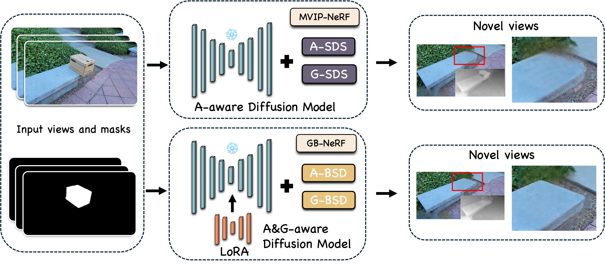
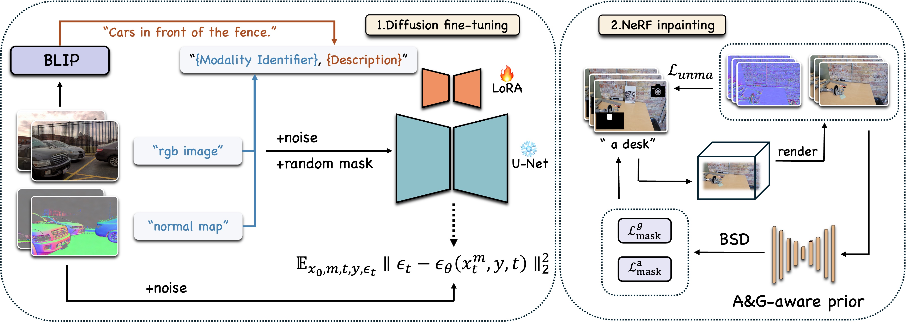

# <span style="color: yellow;">G</span><span style="color: orange;">B</span>-NeRF: NeRF Inpainting with <span style="color: yellow;">G</span>eometric Diffusion Prior and <span style="color: orange;">B</span>alanced Score


[**📚 Paper**](https://arxiv.org/pdf/2411.15551) | [**🖥️ Video**](https://youtu.be/wnqE3VqRMMQ) | [**📊 Dataset**](https://drive.google.com/drive/folders/1N7D4-6IutYD40v9lfXGSVbWrd47UdJEC) | [**🔑 Model**](https://drive.google.com/drive/folders/1A-8kZMvB_IWnnYxaI_KrKokZ0IcUC_n0?usp=sharing)
### 📝 Introduction
We introduce **<span style="color: yellow;">G</span><span style="color: orange;">B</span>-NeRF**, a novel framework that enhances NeRF inpainting through improved utilization of 2D diffusion priors. Our approach incorporates two key innovations: a **fine-tuning strategy** that simultaneously learns appearance and geometric priors and a specialized normal distillation loss that integrates these geometric priors into NeRF inpainting. We propose a technique called **Balanced Score Distillation (BSD)** that surpasses existing methods such as Score Distillation (SDS) and the improved version, Conditional Score Distillation (CSD). BSD offers improved inpainting quality in appearance and geometric aspects. Extensive experiments show that our method provides superior appearance fidelity and geometric consistency compared to existing approaches. 


## 📅 TODO
- [x] Release video results. 🎉 
- [x] Release the code. 🎉 
  


## 🛠️ Quick Start
### 🌟 Dependencies and Environment
Please install [Pytorch](https://pytorch.org/get-started/locally/) according to your CUDA version
```
conda create -n GBnerf python=3.8
conda activate GBnerf
pip install torch==1.13.1+cu117 torchvision==0.14.1+cu117 torchaudio==0.13.1 --extra-index-url https://download.pytorch.org/whl/cu117
pip install -r requirements_df.txt
pip install lpips
pip install ConfigArgParse
pip install peft
```


### 🌟 Dependencies and Environment

Take SPIn-NeRF dataset as example:
```
1
├── images
│   ├── IMG_2707.jpg
│   ├── IMG_2708.jpg
│   ├── ...
│   └── IMG_2736.jpg
└── images_4
    ├── IMG_2707.png
    ├── IMG_2708.png
    ├── ...
    ├── IMG_2736.png
    └── label
        ├── IMG_2707.png
        ├── IMG_2708.png
        ├── ...
        └── IMG_2736.png
    └── Depth
        ├── IMG_2707.png
        ├── IMG_2708.png
        ├── ...
        └── IMG_2736.png

```

### 🌟 Quick Running

Download the pretrained model from [Google Drive](https://drive.google.com/drive/folders/1A-8kZMvB_IWnnYxaI_KrKokZ0IcUC_n0?usp=sharing)

Store the downloaded pretrained model in `DS_NeRF/guidance/ckpt_normalrgb_ps8_lr1e4_rank32_cprompt_caption`

Then, you can use the following command to train NeRF:

```
python run.py --config DS_NeRF/config/aconfig_1.txt
```


### 🌟 Finetune your own diffusion model 

#### 🧪 Preparation
- Dataset: [DIODE](https://diode-dataset.org/)
- Extract caption: [BLIP](https://github.com/salesforce/BLIP)

Note that we only need to extract captions for **RGB images**.
#### 🧪 Complete captions

For example, if the caption you get is "a car," then for an RGB image, the caption will become "RGB image, a car," and for a normal map image, the caption will become "normal map, a car."

`python comp_caption.py --folder /path/to/your/folder --prefix RGB image/normal map`

After running, the content of all .txt files will be modified, with the specified prefix added at the beginning of each file's content.
#### 🧪 Finetune the diffusion model

We follow [dreambooth](https://github.com/huggingface/diffusers/blob/main/examples/research_projects/dreambooth_inpaint/train_dreambooth_inpaint.py) to finetune diffusion.

```
BASE_DIR="GB-NeRF"
DS_NERF_DIR="$BASE_DIR/DS_NeRF"

python $DS_NERF_DIR/guidance/train_dreambooth_inpaint_lora_normal_caption.py \
    --pretrained_model_name_or_path="t" \
    --instance_data_dir="$BASE_DIR/data/images" \
    --output_dir="$DS_NERF_DIR/guidance/ckpt_normalrgb_ps8_lr1e4_rank32_cprompt_caption" \
    --instance_prompt="an image or normal map" \
    --resolution=512 \
    --train_batch_size=8 \
    --use_8bit_adam \
    --gradient_checkpointing \
    --learning_rate=1e-4 \
    --lr_scheduler="constant" \
    --lr_warmup_steps=0 \
    --num_class_images=200 \
    --num_train_epochs=100 \
    --lora_rank=32 \
    --lora_alpha=32

```


## 🌐 Acknowledgement
The repository is based on [MVIP-NeRF](https://github.com/chenhonghua/MVIP-NeRF) and [stable dreamfusion](https://github.com/ashawkey/stable-dreamfusion) 
## 🏆 BibTeX
If you find our GB-NeRF useful in your work, please consider citing it:
```
@misc{zhang2024nerfinpaintinggeometricdiffusion,
      title={NeRF Inpainting with Geometric Diffusion Prior and Balanced Score Distillation}, 
      author={Menglin Zhang and Xin Luo and Yunwei Lan and Chang Liu and Rui Li and Kaidong Zhang and Ganlin Yang and Dong Liu},
      year={2024},
      eprint={2411.15551},
      archivePrefix={arXiv},
      primaryClass={cs.CV},
      url={https://arxiv.org/abs/2411.15551}, 
}
```
## 🚀 Video Result


https://github.com/user-attachments/assets/52ef32d9-3959-440c-82b4-995143b25ef9


